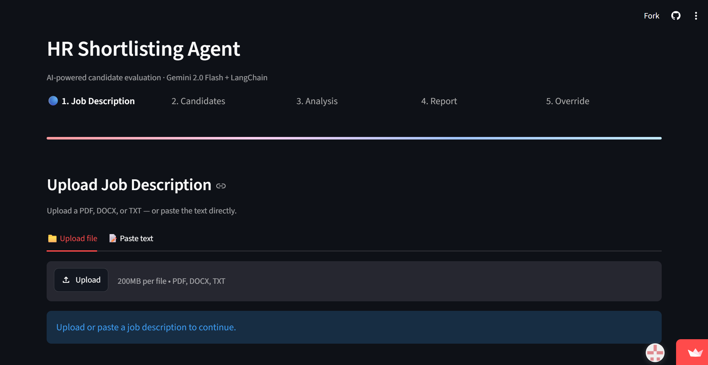
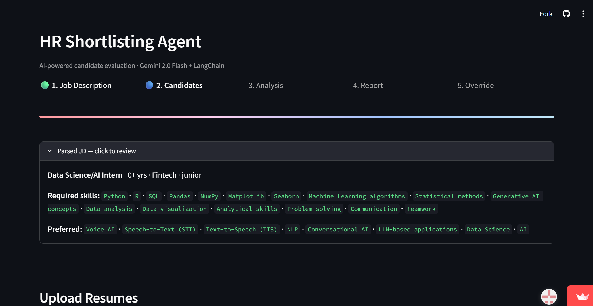
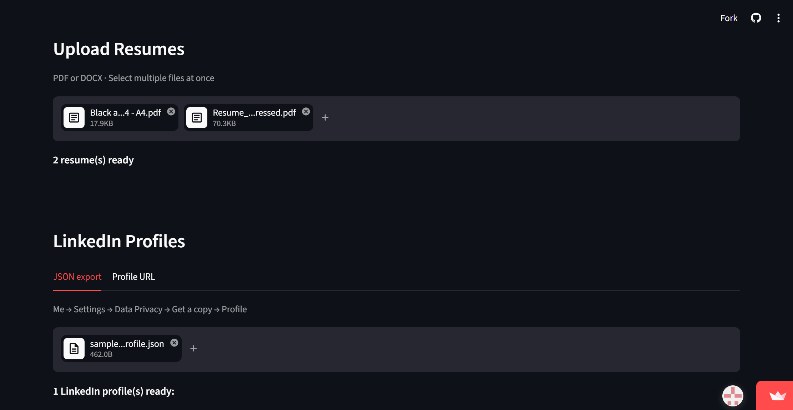
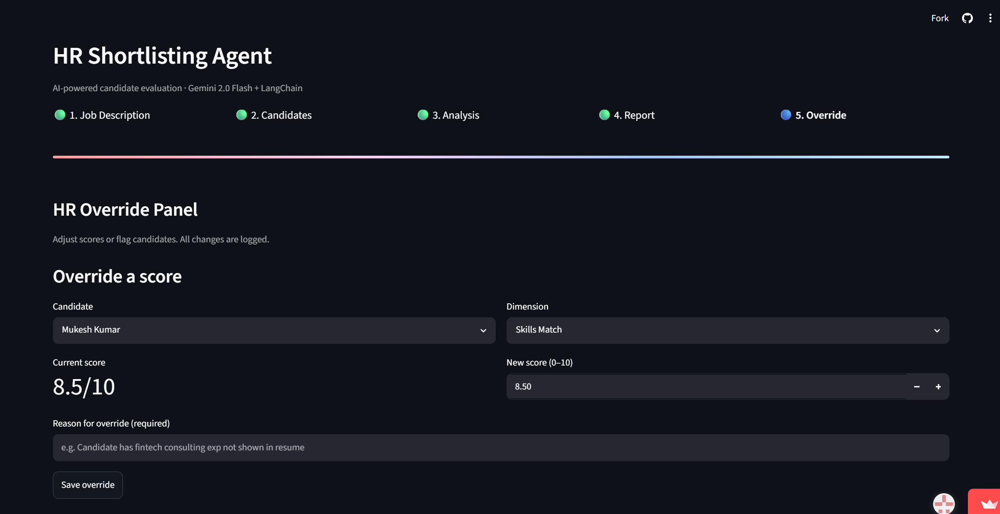

# HR Resume & LinkedIn Shortlisting Agent

An AI agent that helps HR teams evaluate candidates faster and more consistently. Upload a job description and a batch of resumes or LinkedIn profiles — the agent parses everything, scores each candidate across 5 weighted dimensions using Google Gemini, ranks them, and generates a downloadable shortlist report. HR can override any score with a reason, and every change is logged for audit.

---

## Features

- Parses Job Descriptions and resumes (PDF/DOCX) into structured data using Gemini
- Accepts LinkedIn profiles via manually exported JSON
- Scores every candidate on Skills Match, Experience Relevance, Education & Certs, Portfolio, and Communication Quality
- Generates a ranked, downloadable HTML shortlist report
- Human-in-the-loop override panel with full audit trail
- Input sanitization against prompt injection
- Zero-cost LLM calls via Gemini's free tier

---

## Tech Stack

| Layer | Tool |
|---|---|
| LLM | Google Gemini 2.5 Flash |
| Framework | LangChain (ChatPromptTemplate + with_structured_output) |
| Resume Parsing | pdfplumber, python-docx |
| Validation | Pydantic |
| Security | bleach, regex |
| Report | Jinja2 (HTML) |
| UI | Streamlit |

---

## Screenshots

### 1. Job Description Parsing
Upload a JD as PDF, DOCX, TXT, or pasted text. Gemini extracts required skills, experience, domain, and seniority automatically.



### 2. Resume Parsing
Upload multiple resumes at once. Each is parsed into a structured candidate profile — skills, experience, education, and projects.



### 3. Shortlist Report
Candidates are ranked by weighted score with a full rubric breakdown and justification for every dimension. Download as HTML.



### 4. HR Override Panel
HR can adjust any score with a written reason, flag candidates for review, and view a complete audit log of all changes.



---

## Project Structure

```
hr-agent/
├── app.py                  # Entry point — router + session state
├── requirements.txt
├── .env.example
├── src/
│   ├── cache.py            # LLM response caching
│   ├── sanitizer.py        # Input security
│   ├── llm_factory.py      # Gemini client setup
│   ├── jd_parser.py        # JD → structured requirements
│   ├── profile_parser.py   # Resume → candidate profile
│   ├── linkedin_parser.py  # LinkedIn JSON → candidate profile
│   ├── scorer.py           # Rubric scoring engine
│   ├── ranker.py           # Sort by weighted score
│   ├── report_generator.py # Jinja2 HTML report
│   └── override.py         # HR override + audit log
├── pages_ui/                # Streamlit screens
├── templates/
│   └── report.html
└── outputs/                 # Generated reports
```

---

## Setup

**1. Clone and create a virtual environment**

```bash
git clone <your-repo-url>
cd hr-agent
python -m venv venv
source venv/bin/activate      # Windows: venv\Scripts\activate
```

**2. Install dependencies**

```bash
pip install -r requirements.txt
```

**3. Add your API key**

```bash
cp .env.example .env
```

Open `.env` and add your Gemini API key (get one free at [aistudio.google.com](https://aistudio.google.com)):

```
GOOGLE_API_KEY=your_key_here
LLM_PROVIDER=gemini
```

**4. Run the app**

```bash
streamlit run app.py
```

The app opens at `http://localhost:8501`.

---

## How It Works

1. **Upload JD** → Gemini extracts structured requirements (skills, experience, domain)
2. **Upload candidates** → Resumes (PDF/DOCX) and LinkedIn JSON exports are parsed into a unified profile schema
3. **Analyze** → Each candidate is scored against the JD across 5 rubric dimensions
4. **Report** → Candidates are ranked and a downloadable HTML report is generated
5. **Override** → HR can adjust any score with a reason — all changes are logged to an audit trail

---

## Security

- All resume and JD text is sanitized with `bleach` and regex before reaching the LLM, guarding against prompt injection
- API keys are stored in `.env`, excluded from git via `.gitignore`
- Score totals and recommendations are recalculated in Python — never trusted directly from LLM output
- Every HR override requires a written reason and is permanently logged

